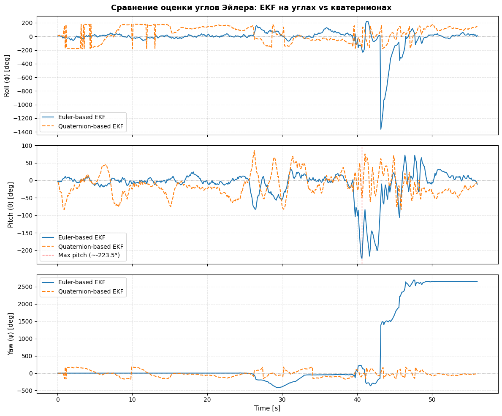
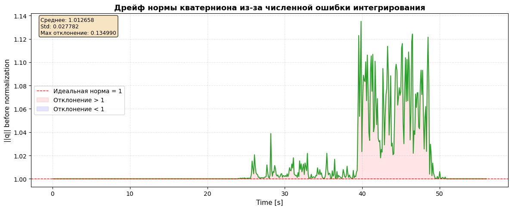

# [HW3] Сравнительный анализ EKF для оценки ориентации

Frolova AI, M25-RO-01

Этот проект посвящен реализации и сравнению двух подходов к расширенному фильтру Калмана (EKF) для оценки ориентации смартфона в пространстве: на основе углов Эйлера и на основе кватернионов.

## 📖 Обзор

В рамках работы выполняются следующие шаги:

1.  **📱 Сбор данных** с помощью смартфона (акселерометр + гироскоп);

2.  **📥 Загрузка и предобработка** CSV-файла с данными сенсоров;

3.  **⚙️ Реализация двух фильтров EKF:**
    *   **Вариант А:** EKF на углах Эйлера (вектор состояния `[roll, pitch, yaw]`).
    *   **Вариант Б:** EKF на кватернионах (вектор состояния `[qw, qx, qy, qz]`).

4.  **📊 Анализ и визуализация:**
    *   Сравнение оценок углов Эйлера (Roll, Pitch, Yaw) для обоих методов на одном графике.
    *   Анализ нормы кватерниона перед нормализацией — визуализация накопления вычислительной ошибки.

## 🗺️ Сбор данных

Для выполнения работы использовалось приложение **Physics Toolbox Sensor Suite** (Android). Данные записывались по заданному протоколу:

1.  Телефон неподвижно лежит на столе (первые 5–10 секунд).
2.  Плавные вращения по всем трем осям.
3.  Достижение угла Pitch ≈ 90° (вертикальное положение телефона) — проверка на **Gimbal Lock**.
4.  Возврат в исходное положение.

**Записанные данные (CSV):**
*   `time` — время в секундах.
*   `ax`, `ay`, `az` — акселерометр (линейное ускорение, м/с²).
*   `wx`, `wy`, `wz` — гироскоп (угловая скорость, рад/с).

## ⚙️ Алгоритм и реализация

### EKF на углах Эйлера (Euler-based EKF)
Вектор состояния: `x = [roll, pitch, yaw]ᵀ`

Прогноз:

Используются показания гироскопа (wx, wy, wz) для интегрирования углов.

Уравнения кинематики:
```
roll_dot  = wx + sin(roll)*tan(pitch)*wy + cos(roll)*tan(pitch)*wz
pitch_dot = cos(roll)*wy - sin(roll)*wz
yaw_dot   = sin(roll)/cos(pitch)*wy + cos(roll)/cos(pitch)*wz
Проблема: деление на cos(pitch) — сингулярность при pitch = ±90° (Gimbal Lock).
```

Коррекция:

Используются показания акселерометра для вычисления углов наклона:

```
roll_meas  = arctan2(ay, az)
pitch_meas = arctan2(-ax, sqrt(ay² + az²))
Матрица наблюдения: H = [[1,0,0], [0,1,0], [0,0,0]] (Yaw не корректируется).
```

---

### EKF на кватернионах (Quaternion-based EKF)

Вектор состояния: `q = [qw, qx, qy, qz]ᵀ`

Прогноз:

Кинематическое уравнение: `q_dot = 0.5 * Ω * q`, где Ω — матрица из компонент гироскопа.

Интегрирование: `q = q + dt * q_dot.`

После каждого шага вычисляется норма ||q|| (анализ ошибки) и выполняется нормализация.

Коррекция:

Проекция вектора гравитации g = [0,0,1] через текущий кватернион:

```
g_est = [2*(qx*qz - qw*qy), 2*(qw*qx + qy*qz), qw² - qx² - qy² + qz²]
```

Измерения: `z = normalize(ax, ay, az)`

Преимущество: кватернионы не имеют сингулярностей и работают во всем диапазоне углов.

Ключевое различие: EKF на углах Эйлера страдает от Gimbal Lock при pitch ≈ ±90°, тогда как кватернионная реализация остается стабильной на всем диапазоне углов.

## Сравнение оценок углов Эйлера
На графиках ниже представлено сравнение оценок углов Roll, Pitch и Yaw для двух реализаций EKF:

- 🔵 Синяя линия — оценка на основе углов Эйлера (Euler-based EKF).
- 🟠 Оранжевая линия — оценка на основе кватернионов (Quaternion-based EKF), переведенная в углы Эйлера для наглядности.



### Ключевые наблюдения:

- **Область малых углов (начало эксперимента):** Оба фильтра дают схожие результаты, что свидетельствует о корректной работе базовых принципов EKF;
- **Gimbal Lock (pitch ≈ 90°):** EKF на углах Эйлера демонстрирует резкие выбросы и потерю устойчивости при приближении угла Pitch к 90°. Это связано с сингулярностью в кинематических уравнениях (деление на cos(pitch));
- Кватернионный EKF сохраняет стабильность и дает гладкую оценку углов, так как кватернионы свободны от сингулярностей.
- **Угол Yaw:** Оба фильтра показывают дрейф, что ожидаемо, так как акселерометр не дает информации об ориентации вокруг вертикальной оси. Кватернионный EKF показывает немного более плавную оценку за счет лучшей численной стабильности.



Наблюдения:

- Идеальная норма: единичный кватернион должен иметь норму ||q|| = 1 (показана красной пунктирной линией).
- Накопление ошибки: Из-за дискретизации и численного интегрирования норма кватерниона отклоняется от единицы. Отклонения как в большую (красная область), так и в меньшую (синяя область) сторону указывают на накопление вычислительной погрешности.
- Эффективность нормализации: Отклонения остаются в пределах 2%, что подтверждает необходимость периодической нормализации кватерниона для поддержания его единичности. В реализованном фильтре нормализация выполняется после каждого шага предсказания, что предотвращает накопление ошибки и деградацию оценки.

# 💡 Выводы

EKF на кватернионах является более предпочтительным методом для оценки ориентации по сравнению с EKF на углах Эйлера, поскольку:

- Кватернионы не имеют сингулярностей (Gimbal Lock) и позволяют работать во всем диапазоне углов.
- Кинематические уравнения кватернионов линейны и проще для численного интегрирования.
- Нормализация кватерниона позволяет контролировать накопление численной ошибки.
- EKF на углах Эйлера работает корректно при малых углах, но становится нестабильным при приближении Pitch к ±90°, что подтвердил эксперимент. Этот метод может быть использован в задачах с ограниченным диапазоном углов, но не подходит для задач, требующих полной свободы ориентации (например, БПЛА, робототехника, VR/AR).
- Анализ нормы кватерниона показал, что численная ошибка интегрирования накапливается со временем и требует периодической нормализации. Без нормализации кватернион может потерять свойство единичности, что приведет к искажению оценки ориентации.
