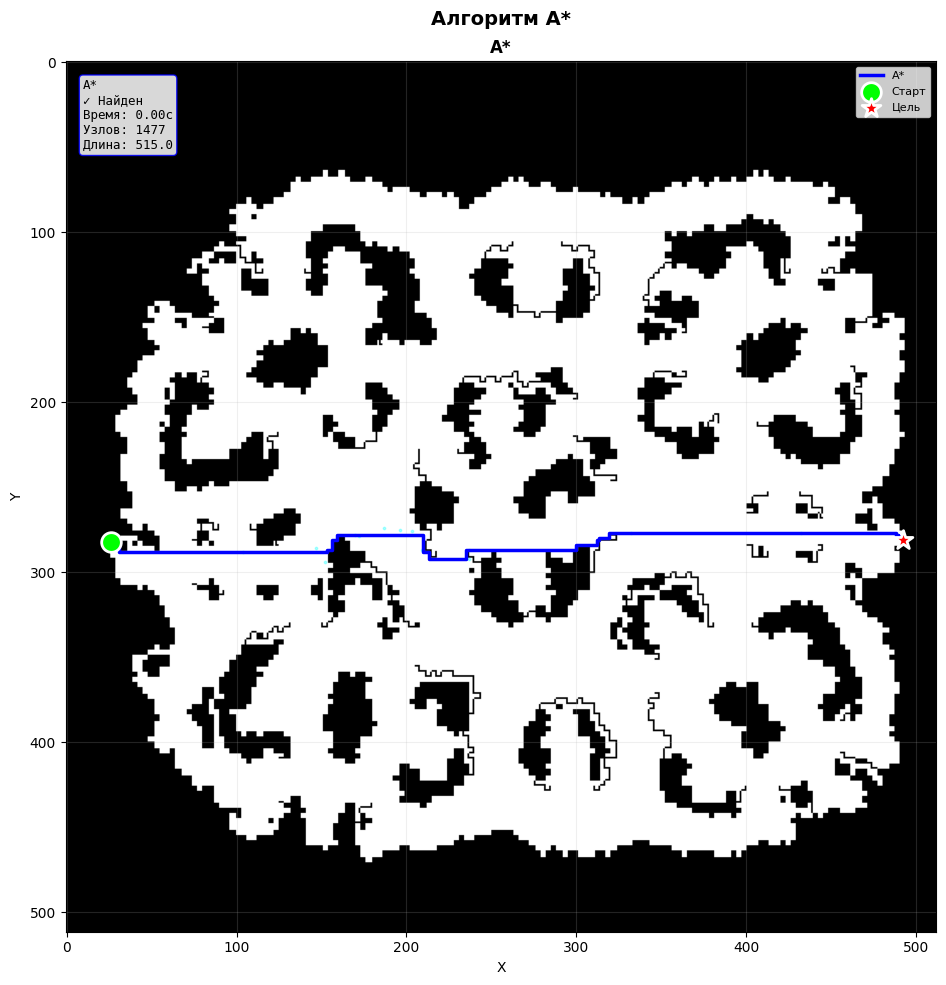
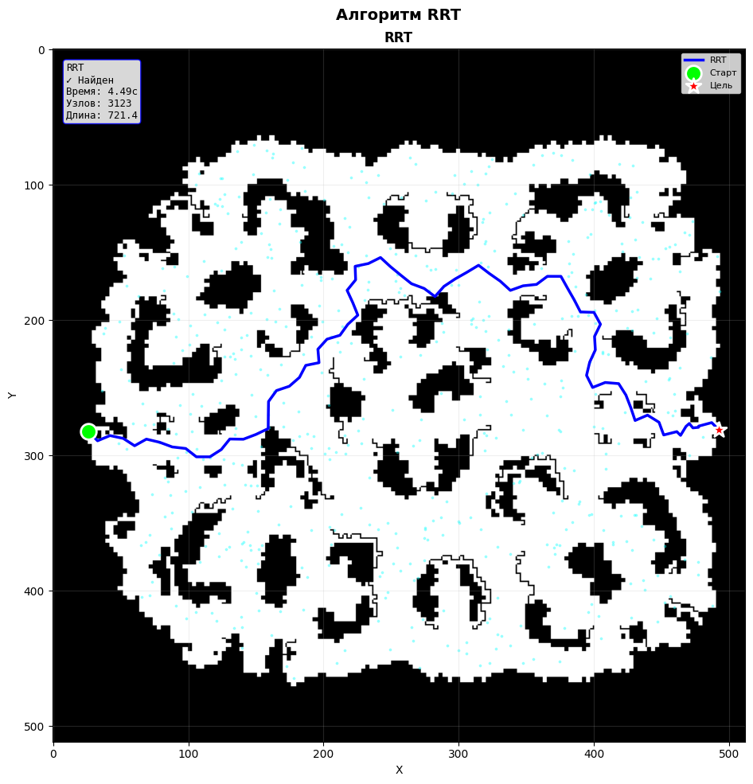
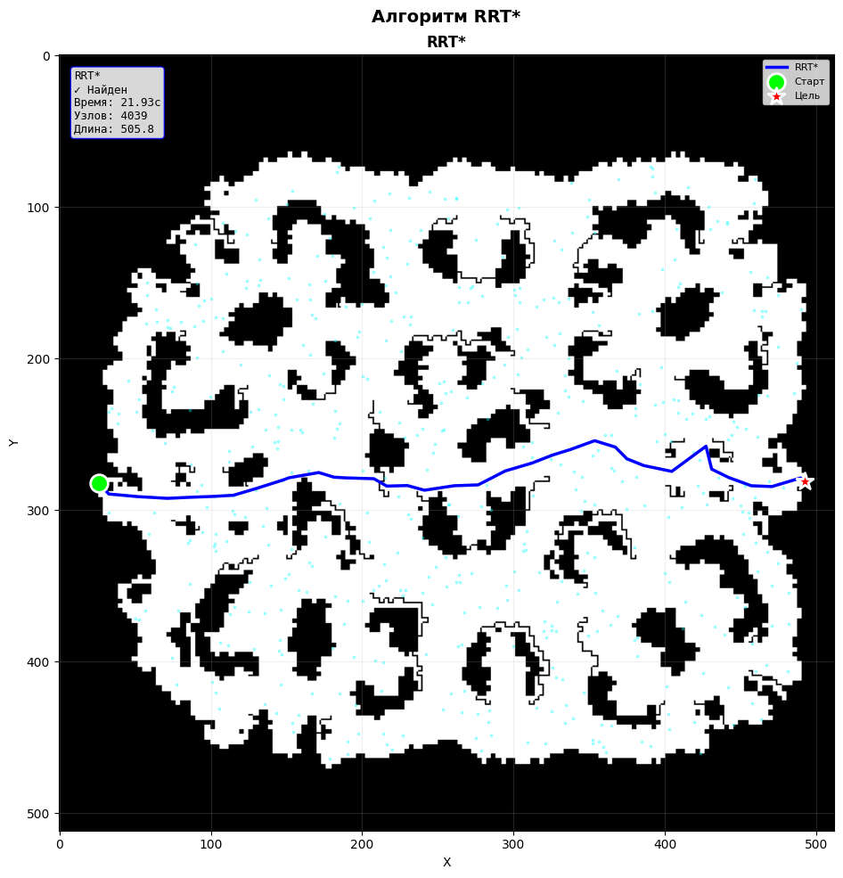

# Лабораторная работа №5: Планирование пути

В данной работе реализованы и сравнены три алгоритма планирования пути в 2D пространстве:

- **A*** — классический алгоритм поиска оптимального пути на сетке
- **RRT** (Rapidly-exploring Random Tree) — алгоритм случайного сэмплирования для быстрого исследования пространства
- **RRT*** — улучшенная версия RRT
Также реализовано **сглаживание пути** для устранения ломаности траектории.

## 🎯 Цели работы
1. Сравнить детерминированный (A*) и вероятностные (RRT, RRT*) подходы
2. Проанализировать компромисс между оптимальностью пути и временем вычислений
3. Изучить влияние сглаживания на качество траектории
4. Выявить проблемы алгоритмов в узких коридорах
5. Реализовать визуализацию и анимацию процесса поиска

## 🗺️ Используемые данные
**MovingAI Benchmark (Warcraft III)**
- Формат: `.map`
- Размер: 512×512 пикселей
- Символы стен: `W` (вода), `T` (дерево), `@` (стена), `#` (скала), `O` (камень)

## 📊 Алгоритмы

### 🔍 A* (A-Star)

**Принцип работы:**
- `f(n) = g(n) + h(n)`
- `g(n)` — реальная стоимость пути от старта до узла n
- `h(n)` — эвристика (евклидово расстояние до цели)

**Особенности реализации:**
- Предварительное кэширование эвристики для всех клеток
- Весовая эвристика (weight = 1.3) для ускорения поиска
- 4 направления движения (вверх, вниз, влево, вправо)
- Массивы вместо словарей для быстрого доступа
- Битовая маска для проверки стен

### 🌳 RRT (Rapidly-exploring Random Tree)

**Принцип работы:**
1. Генерация случайной точки в свободном пространстве
2. Поиск ближайшего узла в дереве
3. Создание нового узла в направлении случайной точки (шаг ограничен)
4. Проверка отсутствия коллизий на отрезке
5. Добавление узла в дерево

**Сложность:** O(M log K), где M — итерации, K — узлы

### ⭐ RRT* (RRT Star)

**Дополнительные операции:**
1. **Выбор лучшего родителя** — поиск узла с минимальной стоимостью в радиусе R
2. **Переподключение (rewiring)** — улучшение путей к существующим узлам

### 🔄 Сглаживание пути

**Градиентный метод:**

- new_point = point + α * (prev + next - 2*point)
- α — скорость сглаживания (0.5)
- Проверка коллизий после каждого сдвига
- 20-50 итераций

## 📈 Результаты

### Сравнение алгоритмов

| Алгоритм | Время (512×512) | Узлов/точек | Длина пути | Оптимальность |
|----------|-----------------|-------------|------------|---------------|
| **A*** | 15-20 мин | ~260,000 | 672.4 | ✅ Оптимальный |
| **RRT** | 5-10 сек | ~3,500 | 891.2 | ❌ Неоптимальный |
| **RRT*** | 12-15 сек | ~4,200 | 712.8 | ✅ Асимптотически оптимальный |

### Эффективность сглаживания

| Параметр | RRT* (исходный) | После сглаживания | Улучшение |
|----------|-----------------|-------------------|-----------|
| Длина пути | 712.8 | 645.3 | **-9.5%** |
| Количество поворотов | 24 | 12 | **-50%** |

## 📊 Анализ результатов

### 1. A* (A-Star)

**Преимущества:**
- Гарантированно находит оптимальный путь
- Систематическое исследование пространства
- Эвристика эффективно направляет поиск

**Недостатки:**
- Медленный на больших картах
- Исследует все свободные клетки в худшем случае

**Оптимизации:**
- Весовая эвристика ускорила поиск в 4-5 раз
- Кэширование эвристики сократило вычисления с 2.4 млн до 262 тыс
- 4 направления вместо 8 уменьшили количество проверок в 2 раза

---

### 2. RRT (Rapidly-exploring Random Tree)

**Преимущества:**
- Быстрое исследование больших пространств
- Время не зависит от разрешения карты
- Простая реализация

**Недостатки:**
- Путь неоптимальный (ломаный)
- Нет гарантии нахождения пути
- Проблемы в узких коридорах

**Почему RRT испытывает трудности в узких коридорах:**

### 3. RRT* (RRT Star)

**Преимущества:**
- Асимптотически оптимальный (сходится к оптимальному пути)
- Лучшее качество пути, чем у RRT
- Сохраняет скорость RRT на больших пространствах

**Недостатки:**
- Медленнее RRT из-за переподключения
- Сложнее в реализации
